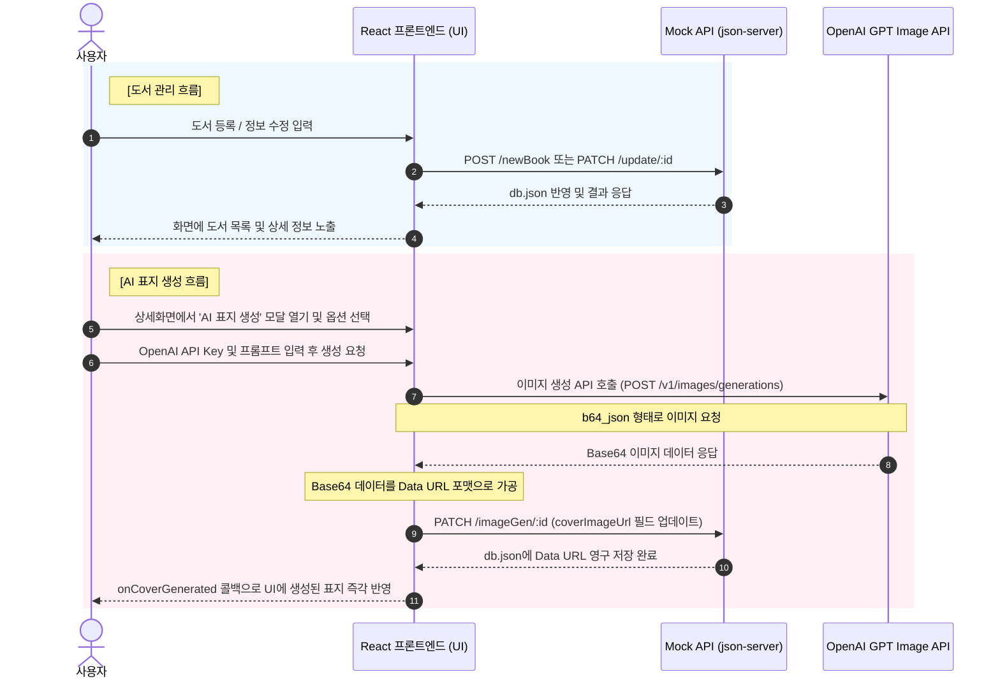

# 작가의 산책 (AI 도서 표지 생성 및 도서 관리 시스템)

> **KT AIVLE SCHOOL AI트랙 9기 4차 미니 프로젝트**  
> OpenAI GPT IMAGE API를 활용한 AI 도서 표지 생성 기능이 통합된 리액트 기반의 도서 관리 시스템입니다.

---

## 🔄 시스템 흐름도 (System Data Flow)

본 프로젝트는 사용자 요청에 따라 도서 데이터를 백엔드 데이터베이스에 연동하고, OpenAI GPT Image API를 호출하여 도서 표지 이미지를 생성하여 저장하는 유기적인 흐름으로 구성되어 있습니다.



---

## 📅 일차별 미션 수행 현황

### 1일차 미션: 기획/설계 및 환경설정 (완료)

#### 📌 미션 1 (기획/설계)
* **도서 데이터 모델 설계 완료**:
  * [db.json]db.json을 활용한 로컬 Mock 데이터베이스에 아래와 같은 도서 속성 구조를 확립했습니다.
    * `id` (도서 고유 식별자, string)
    * `title` (도서 제목, string)
    * `author` (작가명, string)
    * `publisher` (출판사, string - 선택 입력 사항)
    * `content` (작품 소개 및 본문 내용, string)
    * `coverImageUrl` (AI로 생성된 표지 이미지 데이터, string - Base64 Data URL)
    * `createdAt` / `updatedAt` (최초 등록일 / 최근 수정일 타임스탬프, string)
* **팀 표준 API 엔드포인트 규칙 적용**:
  * [routes.json]routes.json을 통해 팀원 간 협의된 명세 기반의 단축 URL 호출 규칙을 프록시 매핑하여 연동의 독립성을 확보했습니다. 공유 PPT 적힌 내용 바탕으로 작성했습니다.
    * 목록 조회: `GET /books`
    * 도서 상세 조회: `GET /bookInfo/:id` -> `/books/:id`
    * 신규 도서 등록: `POST /newBook` -> `/books`
    * 도서 내용 수정: `PATCH /update/:id` -> `/books/:id`
    * 도서 표지 업데이트: `PATCH /imageGen/:id` -> `/books/:id`
    * 도서 삭제: `DELETE /bookDelete/:id` -> `/books/:id`

#### 📌 미션 2 (환경설정)
* **Vite + React (JavaScript) 개발 환경 정비**:
  * 가볍고 직관적인 JavaScript/JSX 컴포넌트 구조로 전면 정비 완료했습니다.
* **json-server 백엔드 목업 구축**:
  * `json-server` 패키지를 설치 및 세팅하고, `package.json`의 `npm run server` 스크립트를 통해 파일 변경 실시간 감시(`--watch`) 옵션을 켜두어 로컬 REST API 연동을 성공적으로 구현했습니다.
  npm install json-server@0.17.4

* **Material UI (MUI) 기반 공통 레이아웃 설계**:
  * `@mui/material`, `@emotion/react`, `@emotion/styled`, `@mui/icons-material`를 적용했습니다.
  * 상단 네비게이션 헤더(`AppBar`), 페이지 중앙화 배치(`Container`), 하단 저작권 푸터(`footer`)를 포함한 [Layout.jsx](file:///c:/Users/User/Desktop/my-app/src/components/Layout.jsx) 공통 컴포넌트를 구축했습니다.
  * `createTheme`와 `ThemeProvider`를 연동해 다크 블루(`primary`)와 옐로우 골드(`secondary`)가 어우러진 고급스러운 색상 팔레트 및 전역 폰트 시스템을 정착시켰습니다.

---

### 2일차 미션: CRUD 조회·등록·수정·삭제 연동 (완료)

#### 📌 미션 3 (조회 연동 - Read)
* **메인 도서 목록 화면 구현 ([BookList.jsx](file:///c:/Users/User/Desktop/my-app/src/components/BookList.jsx))**:
  * 리액트 `useEffect` 훅과 비동기 `fetch` 호출을 연동하여 `GET /books` 경로로 실시간 데이터베이스 정보를 동적 조회합니다.
  * 그리드 카드 형태로 도서의 타이틀, 작가, 출판사명 및 설명 글을 깔끔하게 나열했으며, 최초 등록일 기준 내림차순(최신순) 정렬 기능을 반영했습니다.
  * 책 표지가 지정되지 않은 도서에 대해서는 감성적인 도서 일러스트 템플릿 카드가 나타나도록 대체 디자인을 구현했습니다.
  * 실시간 검색창을 상단에 두어 도서명, 작가명, 설명 본문뿐만 아니라 **출판사명** 키워드를 검색해도 목록이 바로 필터링되도록 검색 알고리즘을 최적화했습니다.
* **상세 조회 화면 구현 ([BookDetail.jsx](file:///c:/Users/User/Desktop/my-app/src/components/BookDetail.jsx))**:
  * 메인 카드 클릭 시 상세 페이지로 이동하며, 날짜 표기 형식(`toLocaleString`)의 현지화 서식을 적용해 시각화했습니다.

#### 📌 미션 4 (등록·수정·삭제 연동 - C/U/D)
* **도서 등록 (Create) & 도서 정보 수정 (Update) ([BookForm.jsx](file:///c:/Users/User/Desktop/my-app/src/components/BookForm.jsx))**:
  * 하나의 컴포넌트가 `bookId` 파라미터 유무에 따라 "도서 등록" 및 "도서 수정" 모드로 자동 동작하도록 로직을 재사용 및 통합했습니다.
  * 빈 입력값 방지를 위한 유효성 유효 체크(`validation error`)를 적용하여 미입력 상태 시 오류 안내 메시지가 실시간으로 활성화되도록 예외 처리했습니다.
  * 등록 시 **`POST /newBook`**, 수정 반영 시 **`PATCH /update/:id`** 표준 API를 연동하여 가상 데이터베이스에 반영했으며 수정 모드 진입 시엔 **`GET /bookInfo/:id`**로 기존 정보를 채웠습니다.
* **도서 삭제 (Delete) ([BookDetail.jsx](file:///c:/Users/User/Desktop/my-app/src/components/BookDetail.jsx))**:
  * 도서 카드 혹은 상세 페이지 내에서 **`DELETE /bookDelete/:id`** 엔드포인트를 호출하여 삭제 처리를 진행합니다.
  * 실수로 인한 삭제 방지를 위해 MUI `Dialog` 기반의 삭제 확인창 팝업 모달을 띄워 사용자 동의를 얻은 후 최종 실행하고 메인 목록을 갱신하도록 처리했습니다.

---

### 3일차 미션: OpenAI 표지 생성 연동 및 최종 조율 (완료)

#### 📌 미션 5 (OpenAI 표지 생성 연동)
* **AI 표지 생성 모달 개발 ([AICoverModal.jsx](file:///c:/Users/User/Desktop/my-app/src/components/AICoverModal.jsx))**:
  * 상세조회 화면에서 바로 띄울 수 있는 팝업 다이얼로그 모달을 개발했습니다.
  * 보안을 위해 OpenAI API Key 입력창은 패스워드 마스크 처리 및 가시성 토글(눈 아이콘) 기능을 탑재했으며, 사용자 편의를 위해 `localStorage`에 안전하게 키값을 자동 기억하도록 세팅했습니다.
  * 모델 규격(gpt-image-2(dall-e-2), gpt-image-3(dall-e-3) 등), 생성 비율(1024x1536 세로 권장형, 1024x1024 정사각형), 품질(Low, Medium, High) 및 출력 이미지 확장자(PNG, JPEG, WEBP)를 조율할 수 있는 정밀 옵션 선택 드롭다운 UI를 적용했습니다.
* **프롬프트 템플릿 설계 및 API 연동**:
  * 도서 상세 본문 정보에 기입된 핵심 텍스트를 파싱하여 기본 프롬프트(`A beautiful artistic book cover for a book titled...`)가 자동 충전되도록 뼈대를 작성했습니다. 사용자가 원하면 직접 편집할 수 있습니다.
  * API 호출 시 Base64 포맷(`response_format: 'b64_json'`) 지정을 통해 결과 이미지를 받아와 React가 해석할 수 있는 Data URL 데이터 포맷(`data:image/png;base64,...`)으로 정밀 가공 변환했습니다.

#### 📌 미션 6 (저장·UX 완성)
* **서버 저장 및 UI 동적 업데이트**:
  * 이미지 생성이 성공하면 즉시 `PATCH /imageGen/:id`를 호출하여 가상의 백엔드 서버 `db.json` 파일에 생성된 표지 Data URL 주소를 최종적으로 영구 저장했습니다.
  * 통신 성공 직후, 메인 화면과 상세 화면의 도서 커버 표지 일러스트 영역이 로딩 지연 현상 없이 즉각적으로 새로운 생성 이미지로 갱신될 수 있도록 전역 콜백(onCoverGenerated) 상태 전이를 설계했습니다.
* **통신 로딩 및 오류 예외 처리**:
  * API 호출 시 버튼 비활성화 및 로딩 스피너(`CircularProgress`) 애니메이션을 연동해 연동 대기 상황을 명확하게 인지할 수 있도록 보완했습니다.
  * API 키 유효성 오류(401), 트래픽 한도 및 크레딧 부족(429), 로컬 백엔드 연동 장애 상황을 실시간 Catch하여 화면에 `MUI Alert` 배너 형태로 명확한 에러 메시지를 띄우는 예외 핸들러를 구축했습니다.

---

## 📂 프로젝트 폴더 구조

```text
my-app/
├── public/                 # 정적 자산 폴더
├── src/                    # 소스 코드 폴더
│   ├── assets/             # 이미지 및 에셋 폴더
│   ├── components/         # React 공통 및 하위 컴포넌트
│   │   ├── AICoverModal.jsx # OpenAI GPT Image API 표지 생성 모달
│   │   ├── BookDetail.jsx   # 도서 상세 조회 및 삭제 화면
│   │   ├── BookForm.jsx     # 도서 등록 및 수정 폼
│   │   ├── BookList.jsx     # 도서 목록 및 검색/정렬 화면
│   │   └── Layout.jsx       # MUI 기반 공통 레이아웃 (헤더, 네비게이션, 푸터)
│   ├── App.jsx             # 메인 앱 컴포넌트 (라우팅 및 상태 관리)
│   ├── index.css           # 전역 CSS 스타일 및 테마 변수 정의
│   └── main.jsx            # React 엔트리 포인트 및 테마 공급자 설정
├── db.json                 # 로컬 Mock 데이터베이스 (도서 데이터 저장)
├── routes.json             # json-server API 엔드포인트 프록시 맵핑 규칙
├── package.json            # 의존성 및 실행 스크립트 정의
├── vite.config.js          # Vite 빌드 환경 설정
└── README.md               # 프로젝트 개요 및 미션 수행 가이드
```

---

## 🛠️ 실행 및 구동 방법

로컬에서 원활하게 도서 및 AI 기능을 연동해 테스트하려면 2개의 터미널 창을 열고 백엔드와 프론트엔드를 동시에 기동해 주어야 합니다.

### 1. Mock API 백엔드 서버 실행
```bash
npm run server
```
* 포트 `3000`번으로 가상 API 서버가 시작되며 [db.json](file:///c:/Users/User/Desktop/my-app/db.json) 파일에 데이터가 저장됩니다.

### 2. React 프론트엔드 개발 서버 실행
```bash
npm run dev
```
* 포트 `5173`번 등으로 Vite 로컬 개발 서버가 기동되며 웹 브라우저를 통해 UI를 이용하실 수 있습니다.
