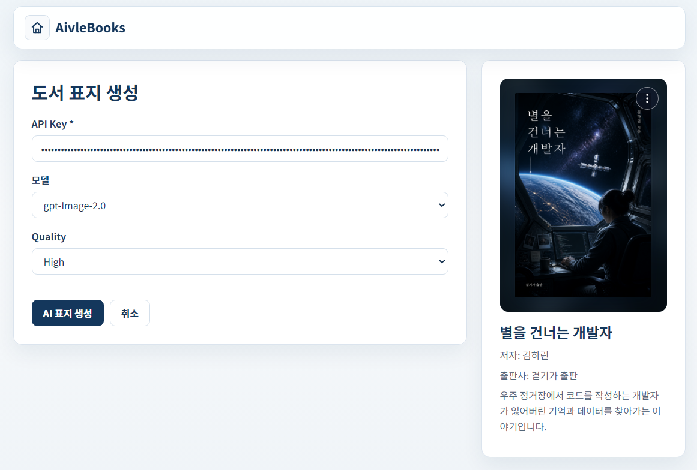
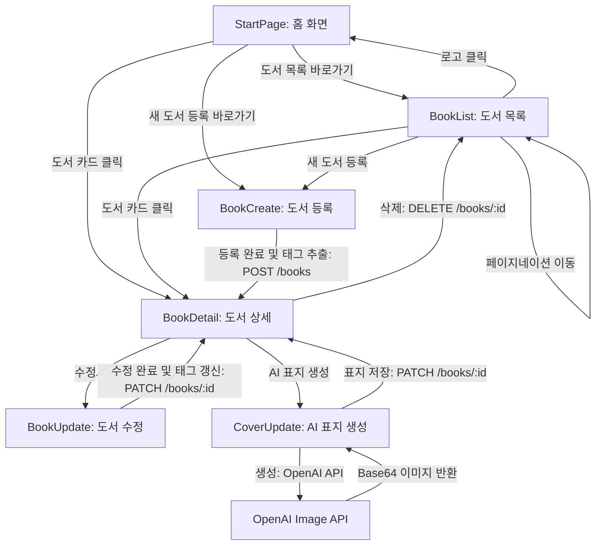

# AivleBooks (창작 서재 관리 서비스)

> **"글과 AI 표지 시안을 함께 관리하는 나만의 창작 서재"**  
> 본 프로젝트는 사용자가 작성한 도서의 메타데이터와 글을 관리하고, OpenAI의 IMAGE API를 연동하여 어울리는 책 표지 시안을 생성·보관하는 웹 서비스입니다.

---

## 주요 기능 (Key Features)

### 1. 메인 홈 화면 (`StartPage`)

- **도서 큐레이션**: 추천수가 가장 많은 **인기 도서 3선**과 등록일 기준 최근에 등록된 **신작 도서 3선**을 한눈에 노출합니다.
- **바로가기 메뉴**: 전체 도서 목록 조회 및 새 도서 등록으로 빠르게 이동할 수 있는 단축 메뉴를 제공합니다.

### 2. 도서 목록 및 검색 (`BookList`)

- **다차원 조건 검색**: 전체 검색뿐 아니라 `제목`, `작가`, `출판사`, `내용`, `태그` 등 개별 필터 타입을 선택하여 실시간으로 도서를 필터링할 수 있습니다.
- **해시태그 기반 검색**: 검색어 앞에 `#`을 붙여 입력할 경우(예: `#소설`) 도서에 등록된 태그만을 타겟팅하는 태그 전용 검색이 가능합니다.
- **페이지네이션(Pagination)**: 한 페이지당 최대 12개의 도서를 렌더링하며, 하단 페이지 네비게이션을 통해 대용량 도서 목록도 쾌적하게 로드합니다.

### 3. 상세 정보 조회 및 추천 (`BookDetail`)

- **상세 데이터 시각화**: 도서의 작가, 출판사, 본문 내용과 함께 시스템이 추출한 핵심 태그 목록, 등록일 및 최종 수정일을 한눈에 구성하여 보여줍니다.
- **도서 추천 및 토스트 피드백**: 마음에 드는 도서에 '추천하기'를 눌러 실시간으로 추천수(좋아요)를 올릴 수 있으며, 추천이 완료되면 토스트 알림창으로 상태를 즉각 피드백합니다.
- **도서 삭제**: 더 이상 보관하지 않을 도서를 즉시 제거할 수 있습니다.

### 4. AI 책 표지 자동 생성 (`CoverUpdate`)

- **IMAGE API 연동**: 도서의 제목, 저자, 본문 키워드를 분석하여 IMAGE API를 통해 맞춤형 세로 표지를 디자인합니다.
- **표지 자동 업데이트**: 생성된 이미지는 Base64 데이터로 변환되어 해당 도서의 정보에 실시간으로 저장 및 렌더링됩니다.

### 5. 다이내믹 AI 추천 헤더 배너 (`Header`)

- **자동 슬라이드 배너**: 홈 및 목록 화면 상단에 5초 주기로 자동 전환되는 다이내믹 롤링 배너 영역을 제공합니다.
- **이 달의 AI 추천 도서**: AI 큐레이션 알고리즘을 거친 추천 도서 정보(`aiRecommendation` 데이터)가 존재할 경우, 추천 도서명과 함께 AI가 추천하는 사유(`reason`)를 배너에 실시간으로 노출합니다.

---

## 서비스 흐름도 (Flow Diagram)



---

## API 엔드포인트 (API Endpoints)

http://localhost:3000/books API 서버에서 사용하는 리소스 엔드포인트 목록입니다.

| HTTP 메서드 | 엔드포인트 | 설명 | 요청 본문(Body) 예시 / 특이사항 |
| :--- | :--- | :--- | :--- |
| **GET** | `/books` | 전체 도서 목록 조회 | - |
| **POST** | `/books` | 신규 도서 등록 | `title`, `author`, `publisher`, `content`, `tags`, `coverImageUrl`, `likeCount`, `createdAt`, `updatedAt` |
| **PATCH** | `/books/:id` | 도서 정보 수정 | `title`, `author`, `publisher`, `content`, `tags`, `updatedAt` |
| **PATCH** | `/books/:id` | 도서 추천 수 증가 | `likeCount` |
| **DELETE** | `/books/:id` | 도서 삭제 | - |
| **POST** | `https://api.openai.com/v1/images/generations` | OpenAI AI 표지 이미지 생성 | Prompt, Model, Quality 등 |

---

## 서비스 기본 구조 (Project Structure)

```text
my-app/
├── docs/                   # 프로젝트 문서화 리소스
│   └── screenshots/        # README.md용 주요 기능 화면 스크린샷 이미지
├── public/                 # 정적 리소스 파일
├── src/                    # 소스 코드 메인 디렉토리
│   ├── assets/             # 기본 로고 이미지 등의 정적 파일
│   ├── components/         # 재사용 가능한 UI 컴포넌트
│   │   ├── BookCard.jsx            # 도서 카드 목록 컴포넌트
│   │   ├── BookForm.jsx            # 도서 등록/수정 폼 컴포넌트
│   │   ├── CoverImageModal.jsx     # AI 표지 크게 보기 모달
│   │   ├── CoverPreview.jsx        # AI 생성 표지 미리보기 및 컨트롤러
│   │   ├── Header.jsx              # 상단 네비게이션 헤더 및 AI 추천 배너
│   │   ├── NewBooksSection.jsx     # 신작 도서 3선 영역
│   │   └── PopularBooksSection.jsx # 인기 도서 3선 영역
│   ├── pages/              # 주요 레이아웃 페이지 컴포넌트
│   │   ├── StartPage.jsx           # 메인 웰컴 홈 화면
│   │   ├── BookList.jsx            # 도서 목록 및 검색 화면
│   │   ├── BookDetail.jsx          # 도서 상세 조회 화면
│   │   ├── BookCreate.jsx          # 도서 생성 화면
│   │   ├── BookUpdate.jsx          # 도서 정보 수정 화면
│   │   └── CoverUpdate.jsx         # AI 표지 생성 화면
│   ├── styles/             # 전역 및 레이아웃 스타일 파일
│   ├── App.jsx             # 비즈니스 로직, 상태 관리 및 라우팅 컨트롤러
│   └── main.jsx            # React 엔트리 포인트
├── db.json                 # 로컬 데이터베이스 (JSON Server용 mock 데이터)
└── package.json            # 의존성 및 실행 스크립트 정의
```

---

## AI 표지 생성 가이드 (AI Cover Generation)

본 서비스의 핵심 기능인 AI 책 표지 생성의 상세 사용 방법입니다.

### 사전 준비 사항
- 이미지 생성을 위해서는 **OpenAI API Key**가 또는 API key가 포함된 .env파일이 필요합니다.

### 사용 단계
1. **상세 페이지 진입**: 도서 목록 또는 홈 화면에서 임의의 도서를 클릭하여 상세 화면으로 이동합니다.
2. **표지 생성 화면 이동**: 상세 화면 우측 하단의 `[AI 표지 생성]` 버튼을 클릭합니다.
3. **API Key 및 옵션 설정**:
   - **API Key**: 본인의 `sk-...`로 시작하는 OpenAI API 키를 입력합니다. (비밀번호 타입으로 마스킹 처리됨)
   - **모델**: 기본 모델이 지정되어 있으며, 필요 시 생성 모델(예: `dall-e-3` 등)로 명칭을 직접 변경하여 실행 가능합니다.
   - **Quality**: Low, Medium, High 중 원하는 이미지 생성 품질을 선택합니다.
4. **AI 생성 실행**: `[AI 표지 생성]` 버튼을 클릭하면 도서의 `제목`, `저자`, `출판사`, `본문내용`을 기반으로 맞춤형 세로 표지가 생성되어 미리보기 화면에 노출됩니다.
5. **로컬 이미지 직접 업로드**:
   - AI 생성 기능을 사용하지 않으려면, 우측 결과 영역에서 파일 아이콘(`파일 선택`)을 클릭해 로컬 PC 안의 파일(`.png`, `.jpg` 등)을 바로 표지로 지정할 수 있습니다.
6. **표지 삭제**: 생성되거나 등록된 이미지 표지가 마음에 들지 않을 경우, `삭제` 버튼을 눌러 기본 표지 상태로 언제든지 되돌릴 수 있습니다.

---

## 기술 스택

- **Frontend**: React, Vite
- **DB**: JSON Server

---

## 실행 방법 (Getting Started)

로컬 개발 환경에서 애플리케이션을 구동하기 위한 순서입니다.

### 사전 준비 사항
- 컴퓨터에 Node.js가 설치되어 있어야 합니다.

### 1. 의존성 패키지 설치
프로젝트 루트 디렉토리에서 터미널을 열고 아래 명령어를 입력하여 필요한 패키지를 설치합니다.
```bash
npm install
```

### 2. Mock API 서버 실행 (포트: 3000)
도서 데이터를 저장하고 응답할 Mock 데이터베이스 서버를 먼저 실행합니다.
```bash
npm run server
```
> **주의**: 프론트엔드가 3000번 포트로 API 조회를 수행하므로, 해당 포트가 실행 중이어야 데이터가 정상 노출됩니다.

### 3. 프론트엔드 개발 서버 실행 (포트: 5173 등)
새로운 터미널 창을 열어 아래 명령어를 통해 리액트 개발 서버를 시작합니다.
```bash
npm run dev
```
서버가 시작되면 화면에 표시되는 로컬 URL(예: `http://localhost:5173`)로 브라우저에서 접속하여 확인합니다.
